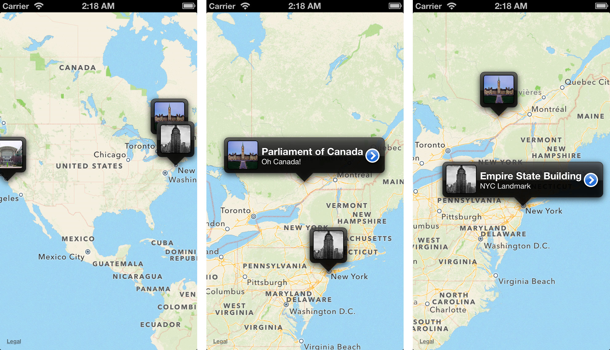

# JPSThumbnailAnnotation

JPSThumbnailAnnotation is a simple mapkit annotation view for displaying people with clean design and animations.



## Installation

### From CocoaPods

Add `pod 'JPSThumbnailAnnotation'` to your Podfile.

### Manually

Copy the `JPSThumbnailAnnotation` folder to your Xcode project and link the `MapKit`, `QuartzCore` and `CoreLocation` libraries.

## Usage

(see sample Xcode project in `/Demo`)

You add an `JPSThumbnailAnnotation` just like any other `MKAnnotation`.

``` objc
JPSThumbnail *thumbnail = [[JPSThumbnail alloc] init];
thumbnail.image = [UIImage imageNamed:@"empire.jpg"];
thumbnail.title = @"Empire State Building";
thumbnail.subtitle = @"NYC Landmark";
thumbnail.coordinate = CLLocationCoordinate2DMake(40.75, -73.99);
thumbnail.disclosureBlock = ^{ NSLog(@"selected Empire"); };

JPSThumbnailAnnotation *annotation = [[JPSThumbnailAnnotation alloc] initWithThumbnail:thumbnail];

[mapView addAnnotation:annotation];
```